# SmartQ — Queue Management SaaS

> **Queue smarter, wait less.** A multi-tenant queue management platform for restaurants, hospitals, banks and more. Customers scan a QR code to join the queue from their phone — no app download required.

🌐 **Live Demo:** [smartq-production1.up.railway.app](https://smartq-production1.up.railway.app)

---

## Screenshots

### Landing Page
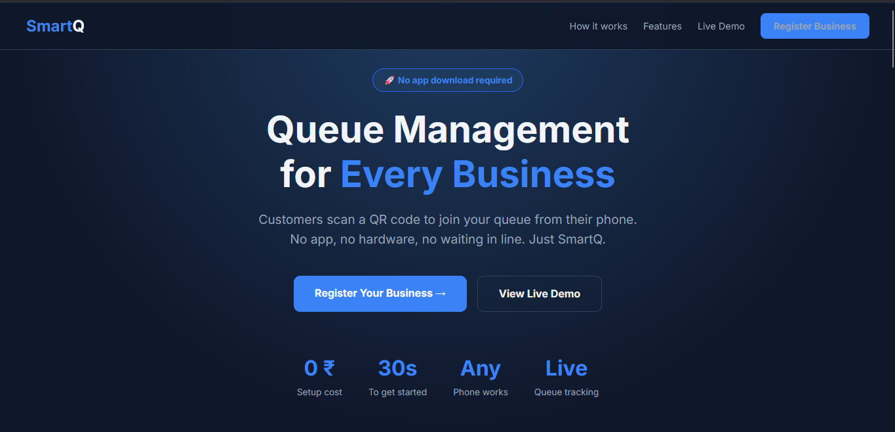

### Owner Dashboard
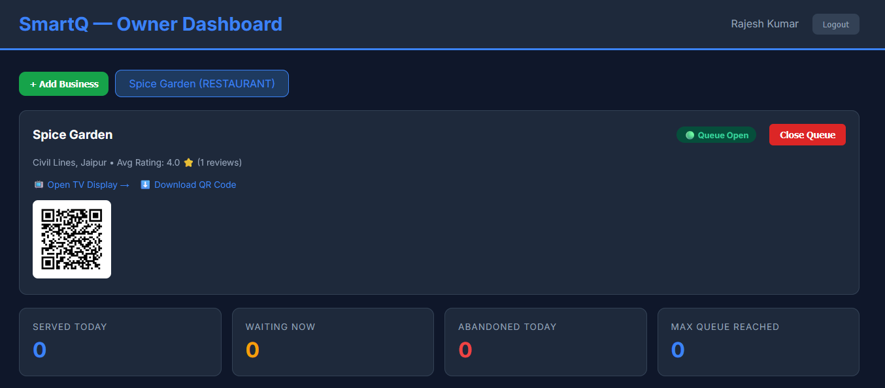
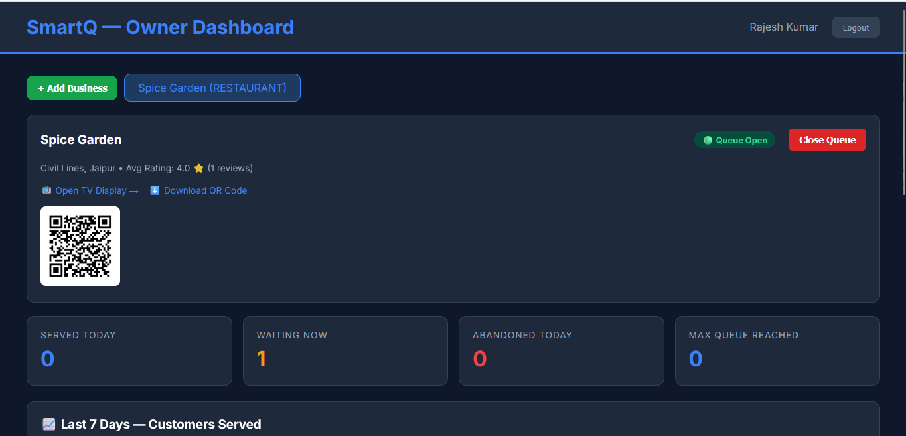
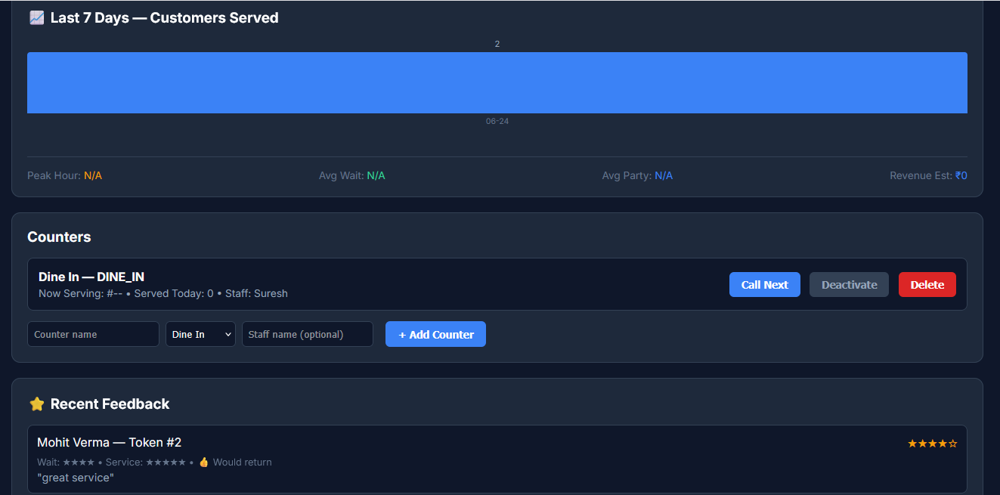

### Customer Flow — Join Queue
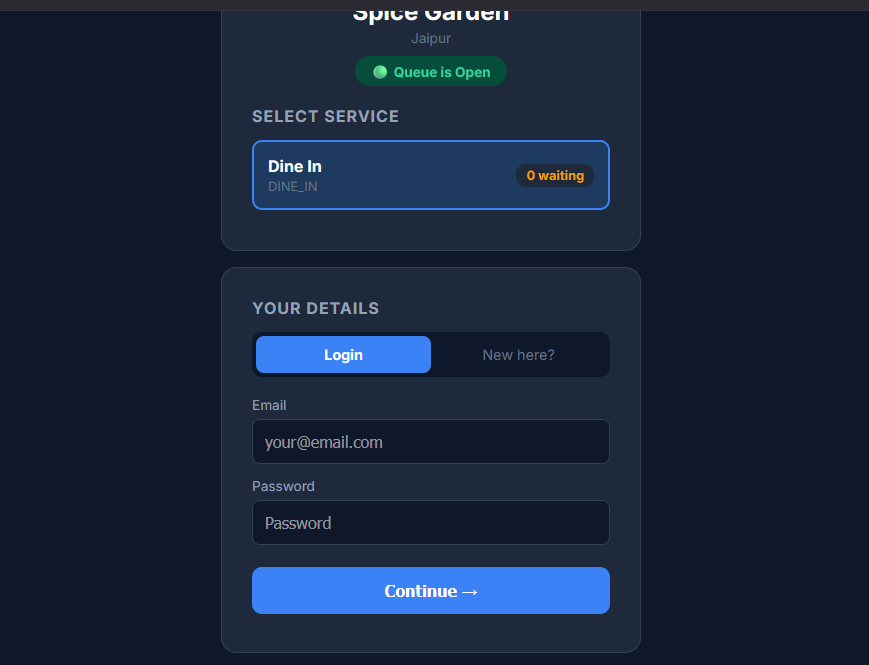
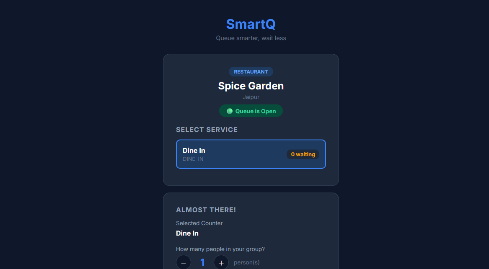
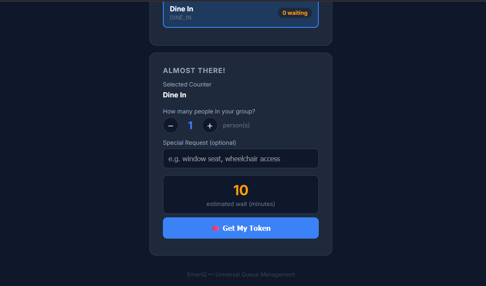

### Customer Flow — Token Status
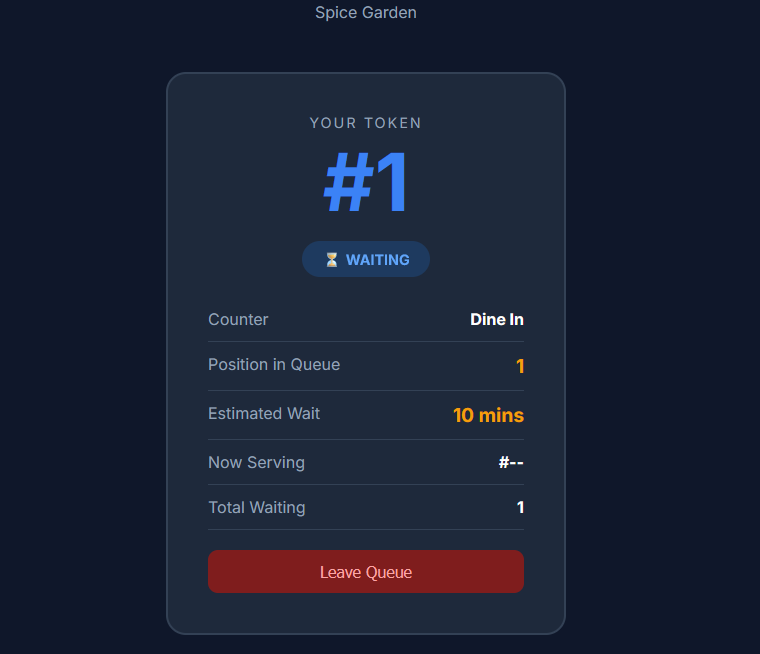
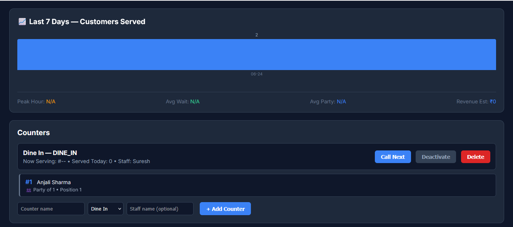
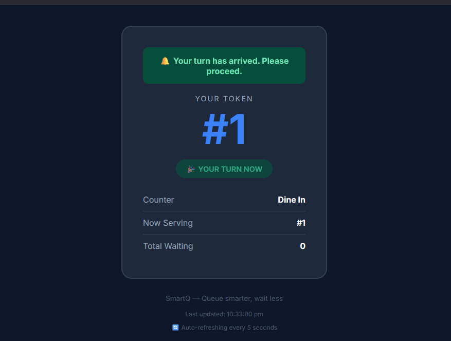

### Feedback
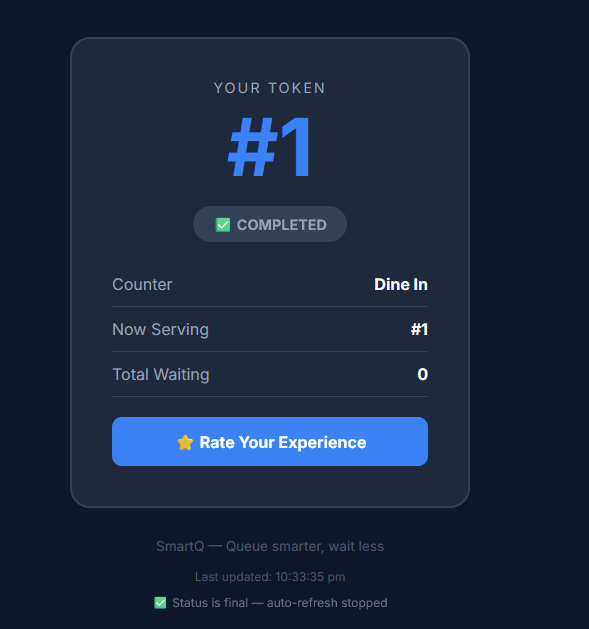
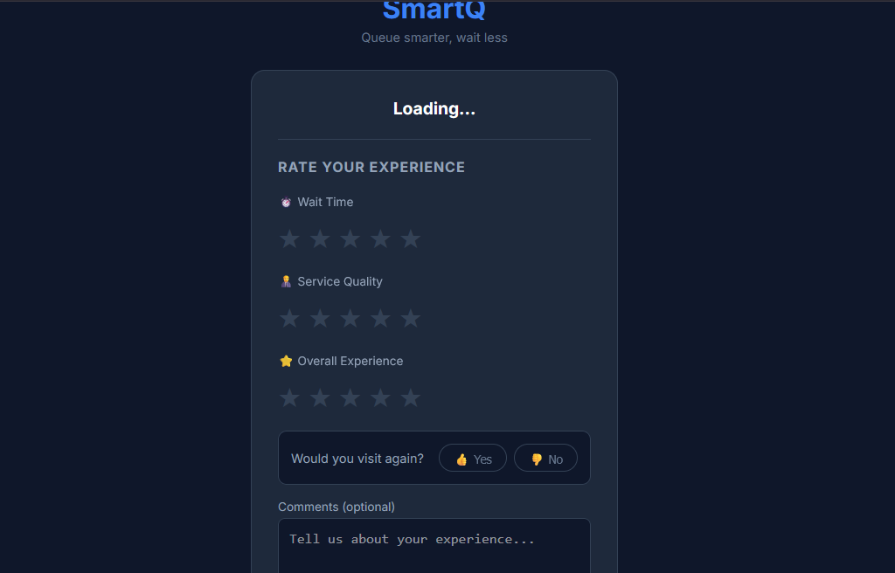

### Admin Dashboard
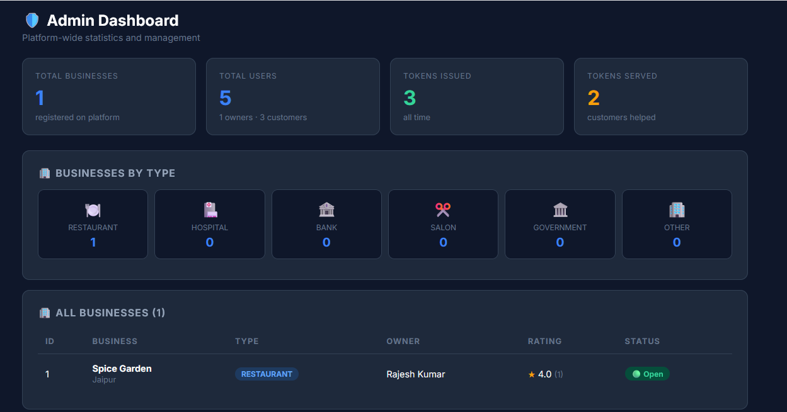

---

## Features

### For Business Owners
- ✅ Register business (Restaurant, Hospital, Bank, Salon, Government, Other)
- ✅ Create and manage multiple counters with staff assignment
- ✅ Open/close queue with one click — resets daily stats automatically
- ✅ Real-time queue dashboard — see live customer list per counter
- ✅ Call Next customer with one click
- ✅ QR code generation — customers scan to join queue instantly
- ✅ Analytics — Served Today, Avg Wait Time, Peak Hour, Revenue Estimate
- ✅ Last 7 days chart of customers served
- ✅ Customer feedback with star ratings
- ✅ Email notifications via Mailgun

### For Customers
- ✅ Join queue by scanning QR code — no app needed
- ✅ Select counter and party size
- ✅ Live token status with position and estimated wait time
- ✅ Auto-refreshes every 5 seconds
- ✅ Email notification when turn is coming (within 3 positions)
- ✅ "Your Turn Now" alert when called
- ✅ Leave queue anytime
- ✅ Submit feedback after visit

### For Platform Admin
- ✅ View all businesses, users, tokens across platform
- ✅ Platform-wide statistics

---

## Tech Stack

| Layer | Technology |
|-------|-----------|
| Backend | Java 21, Spring Boot 3.5 |
| Database | MySQL 8.0 |
| Auth | JWT (jjwt 0.12.6), Spring Security |
| Real-time | Server-Sent Events (SSE) |
| Email | Mailgun REST API |
| QR Code | ZXing library |
| Frontend | HTML, CSS, Vanilla JS |
| Containerization | Docker (multi-stage build) |
| Deployment | Railway |
| Build | Maven |

---

## Architecture

```
┌─────────────────────────────────────────────────┐
│                   Frontend                       │
│  index.html  owner-dashboard.html  admin.html   │
│  join.html   token-status.html     tv-display   │
└──────────────────────┬──────────────────────────┘
                       │ REST API + SSE
┌──────────────────────▼──────────────────────────┐
│              Spring Boot Backend                 │
│                                                  │
│  AuthController    BusinessController            │
│  TokenController   CounterController             │
│  FeedbackController  AdminController             │
│  DisplayController (public, no auth)             │
│                                                  │
│  JWT Filter → Spring Security → Role Check       │
│  (ADMIN / OWNER / CUSTOMER)                      │
└──────────────────────┬──────────────────────────┘
                       │
┌──────────────────────▼──────────────────────────┐
│                  MySQL 8.0                       │
│                                                  │
│  users  businesses  counters                     │
│  tokens  feedback  queue_sessions                │
└─────────────────────────────────────────────────┘
```

---

## Database Schema

```
users           — id, name, email, password, role, phone, total_visits
businesses      — id, owner_id, name, type, city, max_queue_size, avg_rating
counters        — id, business_id, name, type, staff_name, current_token, tokens_served_today
tokens          — id, business_id, counter_id, customer_id, token_number, status, party_size
queue_sessions  — id, business_id, date, total_served, avg_wait_mins, peak_hour, revenue_estimate
feedback        — id, token_id, business_id, customer_id, wait_rating, service_rating, overall_rating
```

---

## API Endpoints

### Auth (Public)
```
POST /api/auth/register    — Register new user
POST /api/auth/login       — Login, returns JWT token
```

### Business (Owner)
```
POST /api/business/create           — Create business
GET  /api/business/my              — Get my businesses
PUT  /api/business/{id}/open       — Open queue
PUT  /api/business/{id}/close      — Close queue
GET  /api/business/dashboard/{id}  — Dashboard data
GET  /api/business/analytics/{id}  — Analytics data
```

### Counter (Owner)
```
POST /api/counter/create          — Add counter
GET  /api/counter/{businessId}    — Get counters
PUT  /api/counter/{id}/activate   — Activate counter
PUT  /api/counter/{id}/deactivate — Deactivate counter
DELETE /api/counter/{id}          — Delete counter
```

### Token (Customer + Owner)
```
POST /api/token/generate           — Join queue (Customer)
GET  /api/token/status/{id}        — Get token status (Customer)
PUT  /api/token/leave/{id}         — Leave queue (Customer)
GET  /api/token/counter/{id}/queue — View queue (Owner)
PUT  /api/token/call-next/{id}     — Call next customer (Owner)
PUT  /api/token/mark-served/{id}   — Mark as served (Owner)
```

### Display (Public — no auth)
```
GET /api/display/{businessId}  — TV display data
```

### Feedback (Customer)
```
POST /api/feedback/submit           — Submit feedback
GET  /api/feedback/business/{id}    — Get business feedback (Owner)
```

### Admin
```
GET /api/admin/stats       — Platform statistics
GET /api/admin/businesses  — All businesses
GET /api/admin/users       — All users
```

---

## User Roles

| Role | Access |
|------|--------|
| `ADMIN` | Platform-wide stats, all businesses and users |
| `OWNER` | Own businesses, counters, queue management |
| `CUSTOMER` | Join queue, view token status, submit feedback |

---

## Queue Flow

```
Customer scans QR
      ↓
Selects counter + party size
      ↓
Gets Token #N (WAITING)
      ↓
Receives email when 3 positions away
      ↓
Owner clicks "Call Next"
      ↓
Token → CALLED ("Your Turn Now" shown)
      ↓
Owner calls next → previous → DONE
      ↓
Customer receives feedback email
      ↓
Customer rates experience (1-5 stars)
```

---

## Running Locally

### Prerequisites
- Java 21
- Maven
- MySQL 8.0
- Docker (optional)

### Steps

```bash
# Clone the repo
git clone https://github.com/dhayalvikas/SmartQ.git
cd SmartQ

# Create local properties file
cp src/main/resources/application.properties src/main/resources/application-local.properties
```

Edit `application-local.properties`:
```properties
spring.datasource.url=jdbc:mysql://localhost:3306/smartq_db
spring.datasource.username=root
spring.datasource.password=yourpassword
jwt.secret=your-256-bit-secret-key-here-minimum-32-chars
mailgun.api.key=your-mailgun-key
mailgun.domain=your-mailgun-domain
mailgun.from.email=SmartQ <noreply@yourdomain.com>
app.base.url=http://localhost:8080
```

```bash
# Run with local profile
mvn spring-boot:run -Dspring-boot.run.profiles=local

# Or with Docker
docker-compose up
```

Open `http://localhost:8080`

---

## Environment Variables (Production)

| Variable | Description |
|----------|-------------|
| `DB_URL` | MySQL JDBC URL |
| `DB_USERNAME` | Database username |
| `DB_PASSWORD` | Database password |
| `JWT_SECRET` | Secret key (min 256 bit) |
| `MAILGUN_API_KEY` | Mailgun API key |
| `MAILGUN_DOMAIN` | Mailgun domain |
| `MAILGUN_FROM` | From email address |
| `APP_BASE_URL` | Production base URL for QR codes |

---

## Docker

```bash
# Build image
docker build -t smartq .

# Run with Docker Compose (app + MySQL)
docker-compose up
```

---

## Project Structure

```
src/main/java/com/smartq/
├── config/          — Security, JWT filter
├── controller/      — REST controllers
├── dto/             — Request/Response DTOs
├── entity/          — JPA entities
├── enums/           — TokenStatus, BusinessType, Role
├── exception/       — Global exception handler
├── repository/      — Spring Data JPA repositories
└── service/         — Business logic

src/main/resources/
├── static/          — Frontend HTML pages
└── application.properties
```

---

## Author

**Vikas Kumar Dhayal**
B.Tech Computer Science — DIT University, Dehradun (2023–2027)
Specialization: Full Stack Development & DevOps

- GitHub: [@dhayalvikas](https://github.com/dhayalvikas)
- LinkedIn: [linkedin.com/in/vikas-kumar-dhayal-5191b9359](https://linkedin.com/in/dhayalvikas)
