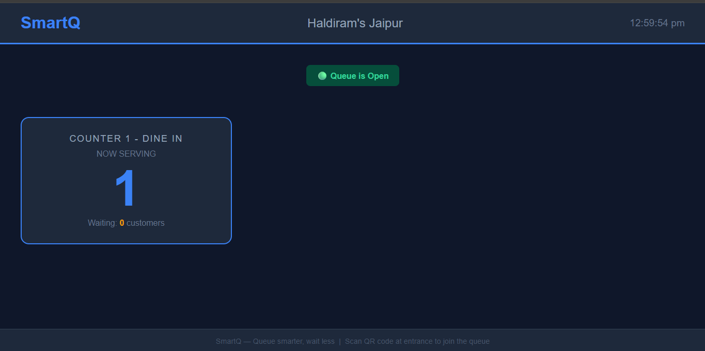

# SmartQ — Universal Queue Management Platform

Queue smarter, wait less.

## About
SmartQ is a universal queue management platform that works 
for any business — restaurants, hospitals, banks, salons, 
and government offices.

Customers get a live digital token on their phone, see 
real-time position, get notified when their turn is near, 
and can wait anywhere freely.

## Tech Stack
- Backend: Java, Spring Boot, Spring Security, JWT
- Database: MySQL, JPA/Hibernate
- DevOps: Docker, GitHub Actions CI/CD
- Notification: Mailgun API
- Deployment: Railway

## Features
- Multi-business support (restaurants, hospitals, banks)
- Multiple counters per business
- Real-time token tracking
- Smart wait time estimation
- TV display screen
- Email notifications
- Analytics dashboard
- Customer feedback system

## Progress
- ✅ Day 3: Project setup, 6 database tables created
- ✅ Day 4: JWT authentication — register and login APIs
- ✅ Day 5: Business management, counter setup, queue open/close
- ✅ Day 6: Token generation, smart wait time formula, live tracking
- ✅ Day 7: QR code generation, TV display screen, public display API
- 🔄 Day 8: Email notifications, customer phone page (next)

## Screenshots

### TV Display Screen
Real-time queue display for restaurant/hospital wall TV.
Shows current token per counter. Auto-refreshes every 5 seconds.

### API Testing
All APIs tested and working via Postman.
JWT authentication protecting all business endpoints.

## Status
🚧 Currently under active development

## Developer
Vikas Kumar Dhayal — B.Tech CSE 2027, DIT University
